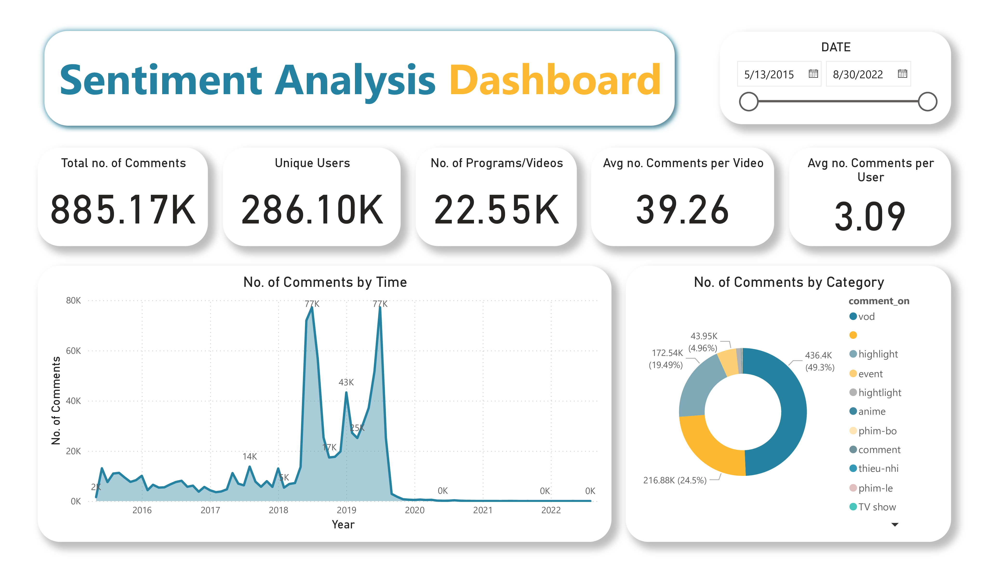
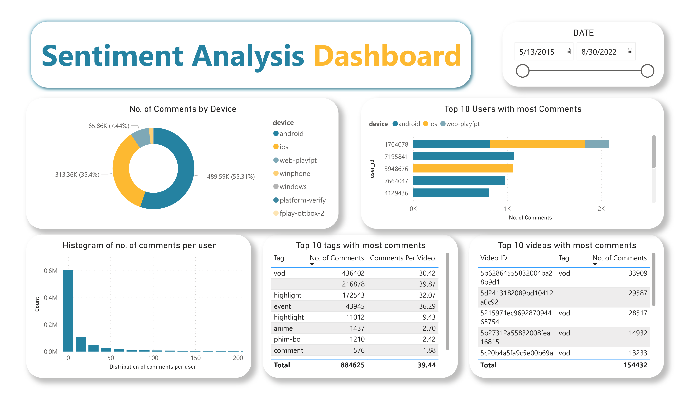
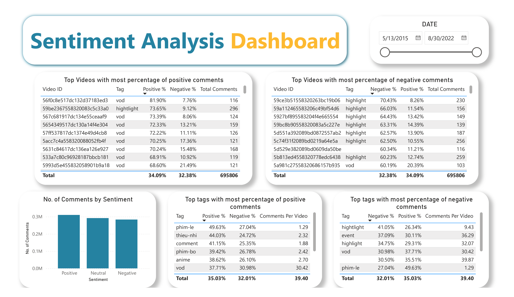

# 📊 Sentiment Analysis

This repository showcases a complete sentiment analysis project built with Power BI, using Vietnamese customer feedback data collected from a video streaming platform. The project includes sentiment classification, data modeling, and interactive dashboard visualization.

---

## 🧠 Project Overview

This project aims to analyze user sentiment based on comments and interaction behavior across various content types. The pipeline includes:

- ETL from MongoDB using Python
- Sentiment classification using PhoBERT (Vietnamese NLP)
- Dashboard visualization with Power BI

---

## 📸 Visualizations

### 📍 Dashboard Overview

### 📍 User vs Video Type Analysis

### 📍 Sentiment Analysis by Tag and Video

---

## 📁 Project Structure

| Path | Description |
|------|-------------|
| `visualization/Dashboard.pbix` | Final Power BI dashboard |
| `visualization/*.png` | Dashboard screenshots |
| `Sentiment code.ipynb` | Python notebook for sentiment classification |
| `Sentiment Analysis report.pdf` | Final report summary |

---

## ⚙️ Technologies Used

- **Python**: Pandas, NumPy, scikit-learn, PhoBERT
- **Power BI**: Data modeling, DAX, custom visuals
- **MongoDB**: Data source (comments, metadata)
- **GitHub**: Version control & collaboration

---

## 📬 Contact

💼 [LinkedIn](https://www.linkedin.com/in/nguyen-thi-minh-huong/)

---
